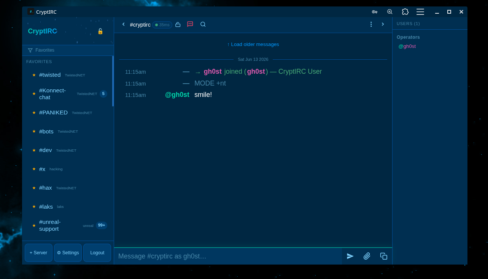

<p align="center">
  
</p>

<h1 align="center">CryptIRC</h1>

<p align="center">
  <strong>End-to-end encrypted IRC client for the web</strong>
</p>

<p align="center">
  
  
  
  
  
  
  
  
</p>

<p align="center">
  <b>For support, bugs, or just want to stop by:</b><br>
  <code>irc.twistednet.org</code> — <b>#dev</b> &amp; <b>#twisted</b>
</p>

<p align="center">
  👻 <b>Developed by gh0st</b>
</p>

<p align="center">
  <b>Don't feel like setting up your own? Use ours — free.</b><br>
  Register at <a href="https://client.twistednet.org/cryptirc"><code>https://client.twistednet.org/cryptirc</code></a><br>
  <sub>Your vault key is derived from your passphrase on your device. The passphrase is <b>never</b> sent to the server or stored anywhere. All your logs, DMs, credentials, and notes are encrypted with that key before they touch disk — even we can't read them.</sub>
</p>

<p align="center">
  
</p>

---

## What is CryptIRC?

CryptIRC is a **self-hosted, encrypted IRC client** that keeps you connected to IRC **24/7** from any device. Your server maintains persistent connections to all your IRC networks — so you never miss a message, even when all your devices are off. When you come back, your full history is waiting, encrypted and synced.

No plugins. No telemetry. No third parties. **You own everything.**

### Available Everywhere

| Platform | How to Get It |
|----------|---------------|
| **Windows** | [Download installer](https://github.com/gh0st68/CryptIRC/releases) — native desktop app with system tray |
| **Linux** | [Download AppImage](https://github.com/gh0st68/CryptIRC/releases) — `chmod +x` and run |
| **macOS** | [Download zip](https://github.com/gh0st68/CryptIRC/releases) — extract and drag to Applications |
| **Android** | Open in Chrome/Brave → Menu → **Add to Home Screen** (PWA) |
| **iPhone / iPad** | Open in Safari → Share → **Add to Home Screen** (PWA) |
| **Any browser** | Just visit your server URL — nothing to install |

The desktop apps and PWA give you push notifications, offline caching, and a native app feel. The web version works anywhere with a browser.

### Encryption — Everything is Encrypted

CryptIRC encrypts **everything** before it touches disk. The server cannot read your messages, logs, or credentials.

- **Encrypted logs** — every message stored on the server is encrypted with your personal vault key (AES-256-GCM). Even the server admin can't read them.
- **Signal Protocol E2E for DMs** — private messages use the same encryption as Signal: X3DH key agreement + Double Ratchet with authenticated headers. Forward secrecy and deniability built in.
- **Channel encryption** — set a pre-shared AES-256-GCM key on any channel. Only people with the key can read messages.
- **Encrypted credentials** — IRC passwords, NickServ passwords, SASL secrets are all encrypted at rest with your vault key. Never stored in plaintext.
- **Encrypted notepad** — private notes encrypted server-side with your vault key.
- **Vault system** — your master passphrase derives an encryption key via Argon2id. Lock the vault and the key is zeroed from memory. Auto-lock after configurable idle time.
- **Zero-knowledge architecture** — the server is a dumb relay. It cannot decrypt anything.

### Key Features

- **24/7 connectivity** — your server stays connected to IRC around the clock, logs everything encrypted, and syncs across all your devices
- **Multi-network** — connect to as many IRC networks as you want simultaneously
- **Multi-device sync** — messages, favorites, settings, unread counts sync across all your devices in real-time
- **Push notifications** — get notified on your phone or desktop when someone DMs or mentions you, even when the app is closed
- **121 themes** (32 with animations like starfields, rain, aurora, matrix rain) and **135 fonts**
- **Full IRCv3 support** — 17 capabilities including typing indicators, away-notify, SASL, MONITOR
- **100+ slash commands** — everything from `/ascii` art to `/ud` Urban Dictionary lookups
- **Nick monitoring** — track when specific users come online/offline with push alerts
- **Inline media** — images, videos, YouTube rich cards, audio player, link previews
- **Mobile-first PWA** — swipe gestures, safe-area support, works perfectly on iOS and Android
- **Single Rust binary** — deploy in one command on any Linux server

### Deployment
- **Single binary** — one `cargo build` and you're done
- Interactive deploy script for **Debian/Ubuntu** and **Arch Linux** with Caddy, Postfix, and systemd
- Automatic **HTTPS** via Caddy + Let's Encrypt
- Hardened systemd unit with **full sandboxing** (ProtectSystem, PrivateTmp, restricted syscalls, no capabilities)
- **Automatic backups** on update — last 5 snapshots of all user data kept in `/var/lib/cryptirc-backups/`
- Existing Caddyfile backed up before overwriting — safe for servers already running Caddy

## Quick Start

```bash
# Clone
git clone https://github.com/gh0st68/CryptIRC.git
cd CryptIRC

# Deploy (Debian/Ubuntu) — single command, sets up everything
sudo bash deploy/deploy.sh yourdomain.com admin@yourdomain.com
```

That's it. Visit `https://yourdomain.com`, register an account, unlock your vault, and connect.

## Features

### Themes (121)

**89 static themes** and **32 animated themes** with real-time canvas effects.

| Theme | Description |
|-------|-------------|
| Starfield Warp | Stars zooming toward you (default) |
| Midnight | Deep dark blue |
| Dracula | Classic purple-accented dark |
| Monokai | Warm syntax-inspired dark |
| Nord | Cool Arctic blue palette |
| Solarized Dark | Ethan Schoonover's classic |
| Gruvbox Dark | Retro warm brown tones |
| Abyss | Pure black void |
| Light | Clean light theme |
| Cobalt | Rich blue editor |
| One Dark | Atom editor inspired |
| Catppuccin Mocha | Pastel dark with lavender accents |
| Rose Pine | Soft muted rose |
| Tokyo Night | Vibrant purple-blue cityscape |
| Cyberpunk | Neon pink and cyan |
| Matrix | Green-on-black terminal |
| Ocean / Ocean Deep / Deep Sea | Sea blue depths |
| Sunset | Warm purple-orange dusk |
| Blumhouse | Horror-inspired dark red |
| Scream | Ghostface neon green |
| Neon Tokyo / Neon Blue / Neon Mint | Neon cityscape / glow themes |
| Vaporwave | Retro pastel purple-pink |
| Blood Moon | Deep crimson dark |
| Arctic / Frost / Glacier / Winterfell / Tundra | Icy cold tones |
| Golden Hour / Solar Flare / Sunflower | Warm amber / golden |
| Midnight Purple / Ultraviolet / Indigo Night | Deep violet / purple |
| Terminal Green / Retro Terminal / Hacker | Green CRT styles |
| Stealth / Charcoal / Graphite / Slate / Zinc / Ash / Noir | Monochrome / gray |
| Lava / Copper / Coffee / Oxide / Pumpkin Spice | Warm earth tones |
| Cyberdeck / Cybernetic | Dark with neon accents |
| Phantom / Obsidian / Darkwave / Storm | Dark mysterious |
| Emerald / Ruby / Sapphire / Amethyst / Coral | Gemstone colors |
| Rose Gold / Sakura / Bubblegum / Candy / Salmon | Pink / rose tones |
| Blade Runner / Outrun / Hotline Miami | Retro neon |
| Lo-fi / Sepia / Desert / Warm Gray | Warm muted vintage |
| Twilight / Dusk / Mauve | Evening purples / soft |
| Wine / Burgundy | Deep red elegance |
| Teal / Spearmint / Verdant / Pine Forest / Wasabi | Green / teal tones |
| Petrol / Mango / Volcanic | Bold accent colors |
| Ivory Tower | Light warm theme |

**Animated themes** (32 with canvas overlay effects):

| Theme | Effect |
|-------|--------|
| Starfield Warp | Stars zooming from center toward you |
| Forest Rain | Rain drops with lightning flashes |
| Deep Space | Drifting stars with shooting stars |
| Snowfall | Gentle falling snowflakes |
| Fireflies | Pulsing, drifting glow dots |
| Aurora | Wavy green/purple light bands |
| Digital Rain | Matrix-style falling characters |
| Neon Grid | 80s Tron perspective grid |
| Underwater | Rising bubbles |
| Cherry Blossom | Pink petals falling |
| Ember | Floating orange sparks |
| Nebula | Colorful drifting gas clouds |
| Confetti | Colorful falling confetti |
| Campfire | Warm embers rising with glow |
| Ocean Waves | Gentle wave motion |
| Plasma | Morphing color gradients |
| Alien | UFOs with tractor beams abducting eSheep |
| Lightning | Storm with zigzag lightning bolts and rain |
| Sandstorm | Desert sand particles blowing across |
| Hologram | Cyan scan lines with shimmer effect |
| Meteors | Streaking meteors across starry sky |
| Pixel Rain | Retro pixel blocks falling |
| Synthwave | Retro sun with perspective grid |
| Toxic Rain | Green acid rain droplets |
| Fairy Dust | Sparkly particles that pulse and drift |
| Comets | Glowing comets with trailing tails |
| Lava Lamp | Soft morphing color blobs |
| Electric | Arcing electric bolts between nodes |
| Galaxy | Spiral galaxy with orbiting stars |
| Glitch | Random colored static and offset glitches |
| Firewall | Scrolling amber hex characters |
| Northern | Vivid multi-color aurora curtains |

**Separate mobile theme** -- independent colors, accents, and font sizes for phone vs desktop.

### Encryption & Security
- **Per-user vaults** -- each user has their own passphrase and encryption key (Argon2id KDF + AES-256-GCM)
- **Signal-protocol E2E** for direct messages -- X3DH key agreement + Double Ratchet with authenticated headers
- **Channel encryption** -- pre-shared AES-256-GCM keys for group channels
- **Encrypted logs** -- every line encrypted at rest with the user's vault key
- **Encrypted notepad** -- private encrypted notes stored server-side
- **Encrypted credential storage** -- IRC passwords, NickServ passwords, and SASL secrets never stored in plaintext
- **Vault lock/unlock** -- locking the vault zeros the key from memory and disconnects IRC
- **Vault auto-lock** -- configurable idle timer (5min–2hrs) automatically locks the vault
- **Client TLS certificates** -- generate and manage ECDSA P-256 certs for SASL EXTERNAL
- **Zero-knowledge architecture** -- the server cannot read your messages or credentials
- **SASL PLAIN protection** -- refuses to send credentials over unencrypted connections
- **Upload metadata stripping** -- all uploads are automatically scrubbed of metadata before being saved to disk:
  - **JPEG**: strips all APP1–APP15 markers (EXIF, XMP, IPTC, GPS coordinates, camera make/model, lens info, timestamps) while preserving APP0 (JFIF), quantization tables, Huffman tables, and image data
  - **PNG**: removes all ancillary chunks (tEXt, iTXt, zTXt, eXIf, dSIG, tIME) while preserving critical chunks (IHDR, PLTE, IDAT, IEND) and safe ancillary chunks (tRNS, gAMA, cHRM, sRGB, iCCP, pHYs)
  - **Video/Audio** (MP4, WebM, MP3, OGG, WAV, FLAC): uses ffmpeg to strip all metadata containers (`-map_metadata -1`) while copying streams untouched — no re-encoding, no quality loss
- **Block private messages** -- +g mode with one-time notification per sender (3-hour cooldown)
- **Session manager** -- view and revoke active sessions across devices
- **Message expiry** -- configurable auto-delete of local message buffers (1hr–7days)
- **Client-side rate limiting** -- configurable flood protection (200ms–3sec between messages)
- **Timing-safe comparisons** -- registration codes use constant-time comparison with no length oracle
- **XSS hardened** -- no inline onclick injection, prototype-pollution-safe E2E objects, comprehensive HTML escaping
- **CSP headers** -- Content-Security-Policy, X-Frame-Options, X-Content-Type-Options, Referrer-Policy
- **Password complexity** -- requires uppercase, lowercase, digit, and special character

### IRC & IRCv3
- Full IRC protocol support -- channels, DMs, modes, kicks, bans, CTCP, the works
- **IRCv3 capabilities**: away-notify, account-notify, extended-join, server-time, multi-prefix, cap-notify, message-tags, batch, echo-message, invite-notify, setname, account-tag, userhost-in-names, chghost, labeled-response, typing indicators, standard-replies, MONITOR
- **IRCv3 CAP toggle** -- enable/disable individual capabilities per network in settings
- **SASL PLAIN & EXTERNAL** authentication
- Multi-network support -- connect to as many networks as you want simultaneously
- **Nick monitoring** -- track when users come online/offline with push notifications
- **KeepNick** -- irssi-style nick keeper with ISON polling, QUIT/NICK event detection, and auto-reclaim
- **Auto-identify** -- automatically send NickServ IDENTIFY on connect (encrypted credential storage)
- **Auto-rejoin on kick** -- automatically rejoin channels after being kicked (with saved channel keys)
- **Channel key manager** -- store and auto-send channel keys (+k) when joining
- **Multi-device sync** -- messages you send on one device appear on all your other devices
- **Typing indicators** -- see when someone is typing (IRCv3 draft/typing)
- **Server-time** -- accurate timestamps from the IRC server
- **ZNC playback detection** -- detects and batches ZNC buffer playback with summary markers
- **Self-signed cert detection** -- popup warning with one-click fix for ZNC/bouncer TLS errors
- **Status message condensing** -- Lounge-style grouped join/part/quit (Show All / Condense / Hide)
- Configurable join/part/quit message filtering
- **Infinite scroll** -- load older messages from encrypted server logs on demand

### Interface
- **Lounge-style layout** -- clean input bar, grouped nick list, collapsible panels
- **Mobile-first PWA** -- installable on iOS/Android with swipe gestures and safe-area support
- **iOS PWA keyboard handling** -- works perfectly with iOS keyboard accessory bar
- **Collapsible panels** -- sidebar and nick list collapse on desktop with persistent state
- **Nick list grouped by role** -- Owners, Admins, Operators, Half-Ops, Voiced, Users
- **Nick context menu** -- whois, query, slap, monitor, notes, kick/ban/voice/op based on power level
- **Clickable nicks in messages** -- nick mentions in chat text are colored and clickable
- **Smart tab completion** -- prioritizes most recent speakers, with Tab cycling
- **@nick autocomplete** -- type `@` to search and insert channel nicks
- **#channel autocomplete** -- type `#` to autocomplete channel names
- **Inline media previews** -- images, videos (.mp4/.webm/.mov), YouTube rich cards with title/author
- **Inline audio player** -- .mp3, .ogg, .flac, .wav, .m4a, .aac, .opus with playback controls
- **Image lightbox** -- click to zoom, scroll wheel zoom, pinch-to-zoom on mobile, pan when zoomed
- **Link previews** -- server-side metadata fetcher with admin whitelist (SSRF protected)
- **Pastebin** -- share text snippets with password protection and expiration
- **URL shortener** -- built-in `/shorten` command creates short redirect URLs with interstitial page
- **Smart paste** -- paste multi-line text and it auto-offers "send as pastebin?" instead of flooding
- **Split view** -- view two channels side by side on desktop (`/split`)
- **Read markers** -- "new messages since you were away" divider line in channels
- **User notes** -- attach private notes to any nick (right-click menu or `/note`)
- **Seen database** -- `/seen nick` tracks last message time and channel
- **Channel stats dashboard** -- most active users with bar chart (`/stats`)
- **ASCII art generator** -- `/ascii text` sends block-letter art to channel
- **Urban Dictionary** -- `/ud word` looks up and sends definitions
- **DND mode** -- Do Not Disturb with scheduled quiet hours (`/dnd`)
- **Encrypted notepad** -- private auto-saving notes, encrypted with vault key
- **mIRC color formatting** -- Ctrl+K color picker, Ctrl+B/U/I/O for bold/underline/italic/reset
- **Topic bar** with mIRC color rendering and edit/copy/view menu
- **Emoji picker** with colon autocomplete (`:wave:` style)
- **Slash command autocomplete** -- type `/` to see all 100+ commands
- **Search** -- search messages in current channel with highlighted results
- **File uploads** -- drag-and-drop or paperclip, with automatic metadata stripping for images, video, and audio (configurable max size from admin panel)
- **My Uploads panel** -- view, manage, and delete your uploaded files
- **Desktop & mobile push notifications** -- iOS PWA support, suppressed when app is focused or DND active
- **Smart unread badges** -- gray for regular messages, red for mentions and DMs
- **Mentions panel** -- chat bubble icon with red dot badge for unseen mentions
- **Custom highlight words** -- tag-based UI to add/remove trigger words for notifications
- **Persistent state** -- everything syncs server-side (themes, favorites, unread, mentions, notes, keys, etc.)
- **Network drag-and-drop** -- reorder networks with all their channels (desktop drag + mobile hold-to-drag)
- **Channel drag-and-drop** -- reorder channels within a network
- **Favorites filter** -- funnel icon filter bar to show only favorited channels
- **Encryption indicators** -- SVG lock/unlock icons on every channel and DM in the sidebar
- **Mobile lag indicator** -- ping time shown next to channel name in topbar
- **SVG icon settings menu** -- clean Lucide-style line icons, scrollable on small screens
- **Standalone security panel** -- vault auto-lock, message expiry, rate limit, PM blocking, spellcheck, link previews
- **135 fonts** -- 41 monospace, 45 sans-serif, 20 serif, 17 display, 12 cursive/handwriting from Google Fonts
- **Clear all data** -- one-click deletion of logs, notepad, and pastes with confirmation

### Admin
- **Admin panel** -- user management, stats, registration settings
- **Link preview whitelist** -- admin controls which domains get metadata fetched
- **Registration modes** -- open, invite-code, or closed (persists across reboots)
- **User management** -- disable, delete, promote to admin
- **All admin settings persist** to disk with mutex protection (survives server restarts)

### Commands

All 100+ commands show in the `/` autocomplete dropdown. Type `/` to browse.

**Channel:**

| Command | Description |
|---------|-------------|
| `/join #channel [key]` | Join a channel (auto-adds # if missing) |
| `/part [#channel] [reason]` | Leave a channel |
| `/cycle` | Part and rejoin channel |
| `/topic [text]` | View or set channel topic |
| `/list` | List all channels on the server |
| `/links` | Show server links |
| `/invite nick` | Invite user to channel |
| `/names` | Refresh the nick list |
| `/key #channel [key]` | Save or clear a channel key (+k) |

**Messaging:**

| Command | Description |
|---------|-------------|
| `/msg nick text` | Send a private message |
| `/query nick [text]` | Open a DM window |
| `/me text` | Send an action |
| `/say text` | Send raw text to current target |
| `/notice nick text` | Send a notice |
| `/ctcp nick command` | Send a CTCP command |
| `/slap nick` | Slap someone with a large trout |

**Identity & Info:**

| Command | Description |
|---------|-------------|
| `/nick newnick` | Change your nickname |
| `/away [message]` | Set away status |
| `/back` | Remove away status |
| `/whois nick` | Look up user info |
| `/whowas nick` | Look up offline user |
| `/who #channel` | List users in a channel |

**User Modes:**

| Command | Description |
|---------|-------------|
| `/mode +mode [args]` | Set channel or user mode |
| `/op` `/deop` | Give/remove operator (+o) |
| `/voice` `/devoice` | Give/remove voice (+v) |
| `/halfop` `/dehalfop` | Give/remove half-op (+h) |
| `/admin` `/deadmin` | Give/remove admin (+a) |
| `/owner` `/deowner` | Give/remove owner (+q) |

**Mass Operations:**

| Command | Description |
|---------|-------------|
| `/opall` | Op everyone in the channel |
| `/deopall` | Deop everyone |
| `/mdop` | Mass deop all except yourself |
| `/drop` | Strip ALL status (~&@%+) from everyone except you |
| `/voiceall` `/devoiceall` | Voice/devoice everyone |
| `/kickall` | Kick everyone except yourself |

**Moderation:**

| Command | Description |
|---------|-------------|
| `/kick nick [reason]` | Kick a user |
| `/ban nick` | Ban a user (nick!*@*) |
| `/unban mask` | Remove a ban |
| `/kickban nick [reason]` | Kick and ban |
| `/tban nick seconds` | Temporary ban with auto-unban |
| `/banlist` | View the ban list |
| `/unbanall` | Remove ALL bans from channel |
| `/unexemptall` | Remove all ban exempts (+e) |
| `/ignore nick\|mask` | Ignore a user (supports wildcards) |
| `/unignore nick\|mask` | Stop ignoring a user |
| `/ignorelist` | Show your ignore list |

**Services:**

| Command | Description |
|---------|-------------|
| `/ns command` | Send to NickServ |
| `/cs command` | Send to ChanServ |
| `/identify password` | Identify with NickServ |
| `/register password email` | Register with NickServ |
| `/ghost nick` | Ghost a nick |
| `/regain nick` | Recover/regain a nick |

**IRCOp:**

| Command | Description |
|---------|-------------|
| `/oper login password` | Authenticate as IRCOp |
| `/kill nick reason` | Kill a user from the network |
| `/shun` `/gline` `/zline` `/kline` | Server bans with duration/reason |
| `/rehash` | Reload server configuration |
| `/squit server reason` | Disconnect a linked server |

**Encryption:**

| Command | Description |
|---------|-------------|
| `/encrypt keygen` | Generate Signal protocol identity |
| `/encrypt on` | Enable E2E for current DM |
| `/encrypt off` | Disable E2E for current DM |
| `/encrypt add #channel` | Set a channel encryption key |
| `/encrypt rotate` | Rotate your E2E keys |

**Tools:**

| Command | Description |
|---------|-------------|
| `/ascii text` | Generate ASCII block-letter art |
| `/ud word` | Urban Dictionary lookup (sends to channel) |
| `/shorten url` | Shorten a URL with built-in shortener |
| `/stats` | Channel statistics dashboard (top talkers) |
| `/note nick [text]` | Set or view private notes on a nick |
| `/seen nick` | When a nick was last seen and where |
| `/dnd on\|off` | Toggle Do Not Disturb mode |
| `/dnd schedule HH:MM HH:MM` | Schedule quiet hours |
| `/split` | Toggle split view (two channels side by side) |
| `/keepnick [nick]` | Keep a nick (auto-reclaim via ISON + events) |
| `/unkeepnick` | Stop keeping a nick |
| `/listnick` | List all kept nicks with status |
| `/ratelimit ms` | Set message rate limit (default 500ms) |
| `/expire hours` | Auto-delete old messages (0 = off) |
| `/autolock minutes` | Vault auto-lock after inactivity (0 = off) |

**Connection:**

| Command | Description |
|---------|-------------|
| `/connect` | Connect to the current server |
| `/disconnect` | Disconnect from the current server |
| `/quote text` | Send a raw IRC command |

**Client:**

| Command | Description |
|---------|-------------|
| `/close` | Close the current DM or channel tab |
| `/clear` | Clear current chat history |
| `/clearall` | Clear ALL chat buffers |
| `/help` | Show help panel with all commands |
| `/ping nick` | CTCP ping a user |
| `/version nick` | CTCP version a user |
| `/time nick` | CTCP time a user |
| `/monitor nick` | Monitor nick online/offline |
| `/unmonitor nick` | Stop monitoring |

**Fun & Emotes:**

| Command | Output |
|---------|--------|
| `/prism text` | Rainbow mIRC colored text |
| `/shrug` | ¯\\\_(ツ)\_/¯ |
| `/tableflip` | (╯°□°)╯︵ ┻━┻ |
| `/unflip` | ┬─┬ノ( º \_ ºノ) |
| `/lenny` | ( ͡° ͜ʖ ͡°) |
| `/disapprove` | ಠ\_ಠ |
| `/rage` | (ノಠ益ಠ)ノ彡┻━┻ |
| `/bear` | ʕ•ᴥ•ʔ |
| `/sparkle text` | ✧･ﾟ: \*✧ text ✧\*:･ﾟ✧ |
| `/finger` | ╭∩╮(︶︿︶)╭∩╮ |
| `/dance` | ♪┏(・o・)┛♪┗(・o・)┓♪ |
| `/rip name` | ⚰️ R.I.P. name ⚰️ |
| `/hug nick` | (づ｡◕‿‿◕｡)づ nick |

**Keyboard Shortcuts:**

| Shortcut | Action |
|----------|--------|
| `Ctrl+K` | mIRC color picker (16 colors, fg+bg) |
| `Ctrl+B` | Bold text |
| `Ctrl+U` | Underline text |
| `Ctrl+I` | Italic text |
| `Ctrl+O` | Reset formatting |
| `Tab` | Smart nick completion (most recent speaker first, cycles) |
| `@` | Nick autocomplete dropdown |
| `#` | Channel autocomplete dropdown |
| `:` | Emoji autocomplete |
| `/` | Slash command autocomplete (100+ commands) |
| `Escape` | Close autocomplete / overlays |
| `↑` / `↓` | Input history navigation |
| `Enter` | Send message |

### Settings

Accessible from the sidebar gear menu:

| Panel | Contents |
|-------|----------|
| Notifications | Push alerts, desktop popups, sounds, trigger rules, custom highlight words (tag UI), per-network mute |
| Theme | 121 themes (32 animated), 135 fonts, font sizes, layout, display options, compact mode, colors, brightness, mobile overrides |
| Security | Vault auto-lock timer, message expiry, rate limit, block PMs (+g), auto-rejoin, link previews, spellcheck |
| Monitor | Nick online/offline tracking with push notifications |
| Notepad | Private encrypted auto-saving notes |
| Certs | Client TLS certificate management for SASL EXTERNAL |
| IRCv3 Caps | Toggle individual IRCv3 capabilities per network |
| Ignored Users | Manage ignore list (nick and wildcard mask support) |
| My Uploads | View, manage, and delete uploaded files with thumbnails |
| Sessions | View and revoke active sessions across devices |
| Vault Password | Change vault passphrase (re-encrypts all data) |
| Help | Complete command reference, features list, keyboard shortcuts |
| Admin | User management, registration settings, link preview whitelist |

### Deployment
- **Single binary** -- one `cargo build` and you're done
- Interactive deploy script for Debian/Ubuntu with Caddy, Postfix, and systemd
- Automatic HTTPS via Caddy + Let's Encrypt
- Hardened systemd unit with full sandboxing

## Architecture

```
Browser (PWA)
  |-- E2E encryption (Signal protocol, Web Crypto API)
  |-- Per-user vault unlock (Argon2id KDF -> AES-256-GCM)
  '-- WebSocket --> CryptIRC Server (Rust/Axum)
                      |-- IRC connections (TLS + IRCv3)
                      |-- Per-user encrypted log storage
                      |-- Push notifications (Web Push / VAPID)
                      |-- Pastebin with password protection
                      |-- URL shortener with interstitial page
                      |-- File uploads with metadata stripping
                      |-- Session management
                      '-- Email verification (Postfix)
```

## Tech Stack

| Layer | Technology |
|-------|-----------|
| Backend | Rust, Tokio, Axum |
| Encryption | AES-256-GCM, Argon2id, HKDF-SHA256, Signal Protocol (X3DH + Double Ratchet + Authenticated Headers) |
| TLS | OpenSSL (client certs), native-tls (server connections) |
| Frontend | Vanilla JS, Web Crypto API, SVG icons (Lucide), CSS custom properties |
| Push | Web Push with VAPID (RFC 8292), iOS PWA support |
| IRC | IRCv3.2 with CAP negotiation (17 capabilities, user-toggleable) |
| Reverse Proxy | Caddy or Nginx (automatic HTTPS) |
| Mail | Postfix (local relay) |

## Configuration

| Variable | Default | Description |
|----------|---------|-------------|
| `CRYPTIRC_DATA` | `./data` | Path to the data directory |
| `CRYPTIRC_BASE_URL` | `http://localhost:9000` | Public URL of your instance |
| `CRYPTIRC_BASE_PATH` | `/cryptirc` | URL path prefix |
| `CRYPTIRC_PORT` | `9001` | Port the server listens on |
| `CRYPTIRC_FROM_EMAIL` | `noreply@cryptirc.local` | Sender address for emails |
| `CRYPTIRC_REGISTRATION` | `open` | Registration mode: `open`, `closed` |
| `CRYPTIRC_REG_CODE` | (none) | Invite code required for registration |
| `RUST_LOG` | `info` | Log level |

## Requirements

- Rust 1.78+
- Linux (Debian 12 / Ubuntu 22.04+ recommended)
- A domain name with an A record pointing to your server
- Ports 80 and 443 open

## License

Private. All rights reserved.
