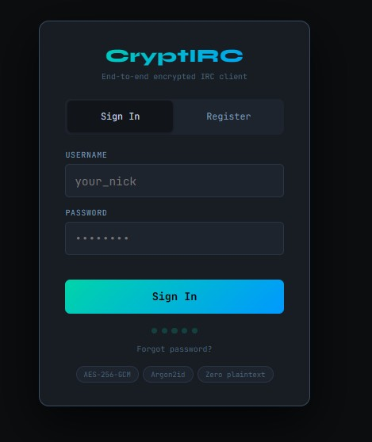

<p align="center">
  
</p>

<h1 align="center">CryptIRC</h1>

<p align="center">
  <strong>End-to-end encrypted IRC client for the web</strong>
</p>

<p align="center">
  
  
  
  
  
</p>

---

## Screenshots

<p align="center">
  
</p>

<p align="center">
  <em>Multi-network IRC with encrypted logs, mIRC colors, nick list, and channel topic</em>
</p>

<br>

<p align="center">
  
</p>

<p align="center">
  <em>Clean login with AES-256-GCM vault encryption and Argon2id key derivation</em>
</p>

---

CryptIRC is a self-hosted, privacy-first IRC client that runs in the browser. Every message, log, and credential is encrypted before it ever touches disk. Connect to any IRC network through a clean, modern interface — no plugins, no Electron, no telemetry.

## Features

### Encryption & Security
- **AES-256-GCM** encrypted logs — every line encrypted at rest with a per-vault key derived via Argon2id
- **Signal-protocol E2E** for direct messages — X3DH key agreement + Double Ratchet
- **Channel encryption** — pre-shared AES-256-GCM keys for group channels
- **Encrypted credential storage** — IRC passwords and SASL secrets are never stored in plaintext
- **Vault system** — all data locked behind a passphrase; nothing is readable without it
- **Client TLS certificates** — generate and manage certs for SASL EXTERNAL auth
- **Zero-knowledge architecture** — the server cannot read your messages or credentials
- **Cross-server E2E** — encrypted DMs work between users on different CryptIRC instances via IRC message splitting

### IRC
- Full IRC protocol support — channels, DMs, modes, kicks, bans, CTCP, the works
- **SASL PLAIN & EXTERNAL** authentication
- Multi-network support — connect to as many networks as you want simultaneously
- Channel and user modes, `/op`, `/voice`, `/kick`, `/ban`, `/topic`, `/ignore`, and more
- **Nick monitoring** — track when users come online/offline with push notifications
- Configurable join/part/quit message filtering
- **Infinite scroll** — load older messages from encrypted server logs on demand

### Interface
- **Lounge-style message layout** — inline timestamp, nick, and message for maximum readability
- **Mobile-first PWA** — installable on iOS/Android with swipe gestures and safe-area support
- **20+ themes** — Midnight, Dracula, Monokai, Nord, Catppuccin, Tokyo Night, Cyberpunk, Matrix, Blumhouse, Scream, and more
- **Separate mobile theme** — independent theme, accents, and font sizes for phone vs desktop
- **Topic bar** with mIRC color rendering and edit/copy/view menu
- **Emoji picker** with colon autocomplete
- Desktop & mobile push notifications with per-channel granularity
- File uploads — share images and videos directly in channels (public URLs for non-CryptIRC users)
- **Persistent state** — open DMs, unread counts, mentions, input history all survive page refresh
- **Nick context menu** — whois, query, slap, monitor, and channel ops (kick/ban/voice/op) based on your power level

### Deployment
- **Single binary** — one `cargo build` and you're done
- Automated deploy script for Debian/Ubuntu with Caddy, Postfix, and systemd
- Automatic HTTPS via Caddy + Let's Encrypt
- Hardened systemd unit with full sandboxing (`ProtectSystem=strict`, `MemoryDenyWriteExecute`, etc.)
- Hot-swap updates with under 1 second of downtime

## Quick Start

```bash
# Clone
git clone https://github.com/gh0st68/CryptIRC.git
cd CryptIRC

# Deploy (Debian/Ubuntu)
sudo bash deploy/deploy.sh yourdomain.com admin@yourdomain.com
```

That's it. Visit `https://yourdomain.com`, register an account, and connect.

## User Registration & Email Verification

CryptIRC uses email verification to authenticate new accounts. Here's how registration works:

1. A user visits the web UI and fills in a **username**, **email**, and **password** (minimum 10 characters)
2. The server creates the account (with `verified: false`) and generates a unique verification token
3. A verification email is sent to the user via **Postfix** running on `localhost:25`
4. The email contains a link: `https://yourdomain.com/auth/verify?token=<uuid>`
5. Clicking the link sets `verified: true` — the user can now log in
6. Verification tokens expire after **24 hours**

### Configuring the From Address

The sender address for verification emails is controlled by the `CRYPTIRC_FROM_EMAIL` environment variable. Set it in your systemd unit or environment:

```ini
Environment=CRYPTIRC_FROM_EMAIL=noreply@yourdomain.com
```

If not set, it defaults to `noreply@cryptirc.local`. The deploy script automatically sets this to the admin email you provide.

### Adding Users Manually (No Email Required)

If you don't want to set up email at all, you can create pre-verified users from the command line:

```bash
sudo bash adduser.sh <username> <email> <password>
```

This creates the user with `verified: true` so they can log in immediately — no email sent, no verification needed.

## Install as a PWA (Mobile & Desktop)

CryptIRC is a Progressive Web App — install it to your home screen and it runs like a native app.

- **iPhone/iPad**: Safari → Share → Add to Home Screen
- **Android**: Chrome → Menu → Add to Home Screen
- **Desktop**: Chrome/Edge → Install icon in address bar

## Architecture

```
Browser (PWA)
  ├── E2E encryption (Signal protocol, Web Crypto API)
  ├── Vault unlock (Argon2id KDF → AES-256-GCM)
  └── WebSocket ──► CryptIRC Server (Rust/Axum)
                      ├── IRC connections (TLS)
                      ├── Encrypted log storage
                      ├── Push notifications (Web Push / VAPID)
                      ├── File uploads
                      └── Email verification (Postfix)
```

## Tech Stack

| Layer | Technology |
|-------|-----------|
| Backend | Rust, Tokio, Axum |
| Encryption | AES-256-GCM, Argon2id, Signal Protocol (X3DH + Double Ratchet) |
| TLS | OpenSSL, rcgen (client cert generation) |
| Frontend | Vanilla JS, Web Crypto API, CSS custom properties |
| Push | Web Push with VAPID (RFC 8292) |
| Reverse Proxy | Caddy or Nginx (automatic HTTPS) |
| Mail | Postfix (local relay) |

## Configuration

| Variable | Default | Description |
|----------|---------|-------------|
| `CRYPTIRC_DATA` | `./data` | Path to the data directory |
| `CRYPTIRC_BASE_URL` | `http://localhost:9000` | Public URL of your instance |
| `CRYPTIRC_BASE_PATH` | `/cryptirc` | URL path prefix |
| `CRYPTIRC_PORT` | `9001` | Port the server listens on |
| `CRYPTIRC_FROM_EMAIL` | `noreply@cryptirc.local` | Sender address for emails |
| `RUST_LOG` | `info` | Log level |

## Requirements

- Rust 1.78+
- Linux (Debian 12 / Ubuntu 22.04+ recommended)
- A domain name with an A record pointing to your server
- Ports 80 and 443 open

## License

Private. All rights reserved.
